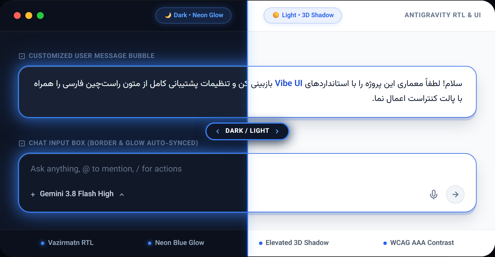
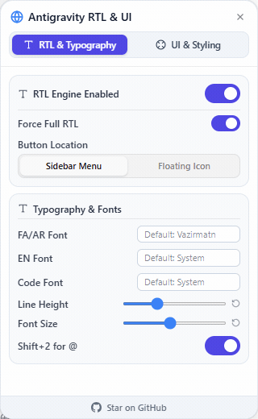
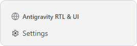
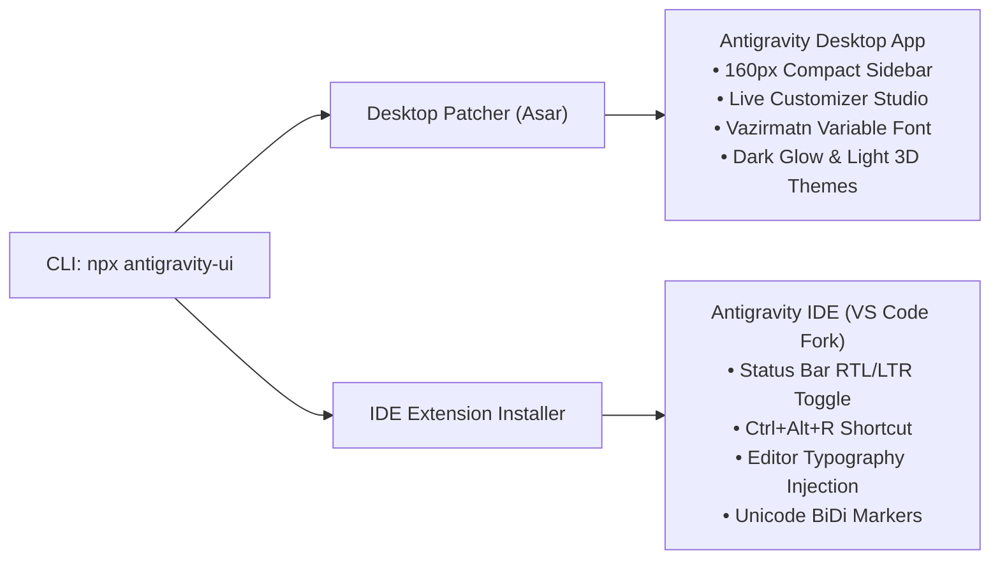

<div align="center">

# 🌌 Antigravity UI Studio

**The complete UI enhancement, workspace ergonomics, and multilingual (RTL/BiDi) studio for Google Antigravity & Antigravity IDE.**

[](LICENSE)
[](https://www.npmjs.com/package/antigravity-ui)
[](https://nodejs.org)
[](https://github.com/google/antigravity)
[](https://github.com/omid-io/antigravity-ui)

<p>
  <a href="#-why-antigravity-ui-the-problems-we-solve">Why Antigravity UI?</a> •
  <a href="#-visual-tour">Visual Tour</a> •
  <a href="#-dual-engine-architecture">Dual Engine</a> •
  <a href="#-features">Features</a> •
  <a href="#-quick-start">Quick Start</a> •
  <a href="#-security-privacy--safety-guarantees">Security & Safety</a> •
  <a href="#-راهنمای-فارسی-persian-guide">راهنمای فارسی</a>
</p>

<br>



</div>

---

## 💡 Why Antigravity UI? (The Problems We Solve)

| Default Google Antigravity | With Antigravity UI Studio |
| :--- | :--- |
| **Fixed 256px Sidebar:** Wastes ~100px of valuable screen space on laptop displays. | **Fluid 160px–420px Sidebar:** Smooth mouse dragging with anti-clipping text layout. |
| **Rigid Chat Styling:** Fixed colors with no control over message contrast or borders. | **Dual Dark Glow & Light 3D Studio:** Custom colors, borders, shadows & live sliders. |
| **Fragmented Multilingual Text:** Persian/Arabic letters reversed, punctuation broken. | **Smart BiDi Engine:** Paragraph-level language detection + built-in Vazirmatn font. |
| **Disconnected IDE:** No unified typography between Chat and Code Editor. | **Companion IDE Extension:** Native VS Code status bar toggle and `Ctrl+Alt+R` hotkey. |
| **Zero Setup Agony:** No manual builds, cloning, or dependency friction. | **Single Command:** Instant execution via `npx antigravity-ui` across macOS, Linux, and Windows. |

---

## 🌟 Visual Tour

<div align="center">
<table>
  <tr>
    <td align="center" width="46%" valign="top">
      <h4>🎛️ Dual-Theme UI Studio</h4>
      <p><sub>Independent Dark (Glow) & Light (3D Shadow) modes with smooth tab physics</sub></p>
      
    </td>
    <td align="center" width="54%" valign="top">
      <h4>📍 Activity Bar Docking & Compact Mode</h4>
      <p><sub>Docked above Settings with fluid mouse dragging down to 160px</sub></p>
      <br>
      
      <br><br>
      <div align="left">
        <ul>
          <li><b>Zero Clutter:</b> Docked inside the sidebar, no floating button obstruction</li>
          <li><b>Fluid 160px Dragging:</b> Natural mouse resize (160px–420px) breaking the 256px limit</li>
          <li><b>Anti-Clipping:</b> Left-pinned text alignment keeps labels fully readable</li>
          <li><b>Click-to-Toggle:</b> Opens on click; cleanly dismisses with <code>Esc</code> or outside click</li>
        </ul>
      </div>
    </td>
  </tr>
</table>
</div>

---

## ⚡ Dual-Engine Architecture

**Antigravity UI** is engineered to provide a cohesive, unified workspace across your entire Google Antigravity workflow:



1. **Antigravity Desktop App:** Injects the live visual customizer studio, ergonomic sidebar resizer, dynamic font sliders, and smart bidirectional text engine.
2. **Antigravity IDE (VS Code Fork):** Automatically detects `antigravity-ide` and installs the native companion extension (`assets/antigravity-ui-1.0.0.vsix`), adding a status bar direction switch and `Ctrl+Alt+R` hotkey for code, markdown, and prompt editing.

---

## ✨ Features

### 🎨 Dual-Theme UI & Styling Engine
- **Independent Theme Tabs**: Customize user message bubbles separately for **Dark Mode** (with vibrant Neon Glow) and **Light Mode** (with elevated 3D shadow).
- **Zero-Inversion Contrast (WCAG AAA)**: Text and labels stay crystal clear across all themes without washed-out labels or inverted colors.
- **Granular Visual Controls**: Custom background color, text color, border width, border color, and shadow intensity presets (`None`, `Soft`, `3D`, `Glow`).
- **Synchronized Chat Input**: Automatically harmonizes the active prompt input box border with your personalized bubble styling.
- **Decoupled Architecture**: Custom UI styling stays 100% active even when the RTL engine is toggled off (ideal for English-only developers who only want the UI perks!).

### 📐 Ergonomic Workspace & Compact Sidebar (160px)
- **Activity Sidebar Docking**: Integrates seamlessly right above the Settings gear icon, keeping the chat canvas clean.
- **Fluid Mouse Resizing**: Natural, smooth mouse dragging across the calibrated 160px–420px range.
- **Compact Sidebar (160px)**: Allows resizing down to 160px with left-pinned CSS rules that prevent text clipping on smaller laptop screens.
- **Click-to-Toggle**: Opens only on click and dismisses smoothly on outside click or the `Esc` key.

### 📝 Smart Multilingual Typography & BiDi Engine
- **Intelligent Auto-Direction**: Dynamically detects paragraph language, right-aligning Persian/Arabic while keeping English and code blocks LTR.
- **Force RTL Mode**: Option to align all content to the right when full RTL layout is preferred.
- **Built-in Vazirmatn Font**: Ships with the modern, high-legibility Vazirmatn Variable font out of the box.
- **Independent Font Families**: Configure separate fonts for RTL text, Latin text, and code blocks.
- **Typography Sliders**: Fine-tune line height and font size with live responsive sliders.
- **Persian Keyboard Optimization**: Automatically maps `Shift + 2` to type `@` instead of `٬` on Persian keyboard layouts.
- **Zero White-Screen Startup Guard**: Runs inside an isolated IIFE with safe lifecycle hooks to prevent Electron startup race conditions.

---

## 🚀 Quick Start

No repository cloning or manual file copying required. Simply run the command for your operating system:

### Windows
Open **PowerShell** as **Administrator** (Right-click -> Run as Administrator), then run:
```powershell
npx antigravity-ui
```
*(Legacy alias `npx antigravity-rtl` is also fully supported)*

### macOS
Ensure [Node.js](https://nodejs.org) is installed (e.g. `brew install node`). Run with `sudo`:
```bash
sudo npx antigravity-ui
```
> **macOS Note:** If you encounter a "Permission Denied" error with `sudo`, ensure your terminal app has **App Management** permission in `System Settings > Privacy & Security > App Management`.

### Linux
```bash
sudo npx antigravity-ui
```

### CLI Flags
- `--restore`: Revert Antigravity Desktop and IDE to their factory state.
- `--devtools`: (Optional) Enable Chromium DevTools in the packaged desktop app for custom DOM debugging.

> [!TIP]
> **Antigravity Updates:** Updating Antigravity will reset patched desktop files. Simply re-run `npx antigravity-ui` after any official app update to restore your custom studio.

---

## 🛡️ Security, Privacy & Safety Guarantees

Because Antigravity UI interacts with application packaging files, we hold trust and data safety to the highest standard:

- 🔒 **100% Offline & Private:** Zero telemetry, analytics, or background internet requests. Your code and chats never leave your machine.
- 🛡️ **Untouched Safety Backup:** Automatically creates an untouched `app.asar.bak` before making any modification.
- ⚡ **One-Command Full Revert:** Run `npx antigravity-ui --restore` at any moment to return everything to 100% factory state.
- 🎯 **Minimal & Non-Invasive:** Only injects lightweight client CSS and DOM ergonomics; never alters your API keys, credentials, or workspace data.
- 🛠️ **Opt-In DevTools:** DevTools inspection is disabled by default and only enabled if you explicitly pass `--devtools`.

---

## 🔄 Uninstall / Restore

To revert Antigravity Desktop and Antigravity IDE to their factory state at any time:

```bash
npx antigravity-ui --restore
```
*(On macOS/Linux, prepend `sudo`)*

---

## 🏛️ Attribution & Credits

- Based on initial proof-of-concept by **Mohammad Mahdi Naderi** (`mmnaderi/antigravity-rtl`).
- Re-engineered, decoupled, and maintained by **Omid Zaferi** (`omid-io/antigravity-ui`) as an independent full-suite UI studio with IDE integration and laptop ergonomics.

---

<div dir="rtl">

# 🇮🇷 راهنمای فارسی (Persian Guide)

<div align="center">

## سوئیت جامع ارتقای رابط کاربری، سایدبار ارگونومیک و پشتیبانی هوشمند فارسی در Antigravity

**شخصی سازی پیشرفته رابط کاربری، کاهش عرض سایدبار تا ۱۶۰ پیکسل، پشتیبانی کامل از فونت وزیرمتن و هماهنگی همزمان با ادیتور کد Antigravity IDE**

<br>


</div>

---

### 💡 چرا Antigravity UI؟ (مشکلاتی که حل می کنیم)

| پیش فرض Google Antigravity | با Antigravity UI Studio |
| :--- | :--- |
| **سایدبار ثابت ۲۵۶ پیکسل:** هدر رفتن فضای ارزشمند مانیتور به خصوص در لپ تاپ ها. | **سایدبار منعطف ۱۶۰ تا ۴۲۰ پیکسل:** درگ کاملاً روان موس با چیدمان ضد بریدگی متن. |
| **ظاهر ثابت و یکنواخت چت:** عدم امکان شخصی سازی رنگ یا خوانایی حباب پیام ها. | **استودیو تم دارک نئونی و لایت ۳ بعدی:** کنترل اسلایدرهای فونت، حاشیه و سایه. |
| **به هم ریختگی متون چندزبانه:** برعکس شدن حروف فارسی/عربی و پرش علائم نگارشی. | **موتور هوشمند BiDi:** تشخیص خودکار زبان پاراگراف + فونت توکار وزیرمتن. |
| **ناهماهنگی ادیتور و چت:** عدم وجود فونت و جهت مناسب در ادیتور کد Antigravity IDE. | **افزونه اختصاصی ادیتور:** سوییچ جهت در Status Bar و میانبر `Ctrl+Alt+R`. |

---

### 🌟 قابلیت های کلیدی

#### ۱. معماری موتور دوگانه (Desktop + IDE)
* **اپلیکیشن دسکتاپ Antigravity:** پچ امن و خودکار فایلهای هسته، فعال سازی استودیو کاستومایزر، تنظیم اسلایدرهای فونت و پشتیبانی از سایدبار ۱۶۰ پیکسلی.
* **ادیتور کد Antigravity IDE:** شناسایی خودکار ادیتور کد (بر پایه VS Code) و نصب افزونه اختصاصی با کلید میانبر `Ctrl+Alt+R` و دکمه تغییر جهت در نوار وضعیت (Status Bar).

#### ۲. استودیو شخصی سازی پیام ها (Dual Dark/Light UI)
* **دو تب مستقل برای دارک مود و لایت مود:** تنظیم مجزای استایل پیام ها در تم تیره (با افکت درخشش نئونی / Neon Glow) و تم روشن (با سایه برجسته سه بعدی / 3D Shadow).
* **کنتراست استاندارد WCAG AAA:** تضمین خوانایی ۱۰۰٪ متون و لیبل ها در هر دو تم بدون هیچ گونه وارونگی یا محو شدگی.
* **کنترل کامل المان های بصری:** شخصی سازی رنگ پس زمینه، رنگ متن، رنگ و ضخامت کادر و شدت سایه.
* **استقلال کامل از موتور RTL:** اگر تمایلی به راست چین کردن متون نداشته باشید، می توانید موتور RTL را خاموش کرده و صرفاً از سایدبار ۱۶۰ پیکسلی و کاستومایزر ظاهر استفاده کنید.

#### ۳. سایدبار ارگونومیک فشرده (Compact 160px)
* **جای گیری شیک در سایدبار بالای Settings:** خلوت ماندن محیط کار بدون مزاحمت دکمه های شناور.
* **درگ آزاد و روان موس بین ۱۶۰ تا ۴۲۰ پیکسل:** شکستن محدودیت ۲۵۶ پیکسلی پیش فرض نرم افزار و صرفه جویی در فضای مانیتور لپ تاپ ها.
* **بدون بریدگی متون:** چیدمان پین شده به چپ برای حفظ خوانایی منوها حتی در عرض ۱۶۰ پیکسل.

#### ۴. تایپوگرافی هوشمند و فونت وزیرمتن
* **راست چین خودکار پاراگراف ها:** تشخیص هوشمند زبان هر پاراگراف؛ متن فارسی راست چین و کدهای انگلیسی چپ چین می مانند.
* **فونت توکار Vazirmatn Variable:** بالاترین سطح وضوح و خوانایی بدون نیاز به نصب دستی فونت در سیستم عامل.
* **حل مشکل کیبورد فارسی:** نگاشت خودکار کلید ترکیبی `Shift + 2` برای تایپ کاراکتر `@` به جای «٬» در چیدمان فارسی.

---

### 🛡️ تضمین های امنیتی و حفظ حریم خصوصی

- 🔒 **۱۰۰٪ آفلاین و محلی:** بدون هیچ گونه ارسال تله متری، لاگ یا ارتباط با سرور خارجی. کدهای شما هرگز از دستگاهتان خارج نمی شود.
- 🛡️ **بکاپ خودکار و دست نخورده:** ایجاد نسخه پشتیبان `app.asar.bak` پیش از هرگونه تغییر برای اطمینان خاطر.
- ⚡ **بازگردانی ۱۰۰٪ با یک دستور:** قابلیت بازگشت کامل به حالت کارخانه با `npx antigravity-ui --restore`.
- 🛠️ **حفظ امنیت:** ابزار DevTools به صورت پیش فرض خاموش است و صرفاً در صورت ارسال فلگ اختیاری `--devtools` برای برنامه نویسان فعال می شود.

---

### 🚀 نحوه نصب و اجرا

ترمینال سیستم عامل خود را باز کرده و دستور زیر را اجرا نمایید:

#### در ویندوز (Windows)
برنامه **PowerShell** را با راست کلیک و انتخاب **Run as Administrator** اجرا کرده و دستور زیر را بزنید:
```powershell
npx antigravity-ui
```

#### در مک (macOS)
```bash
sudo npx antigravity-ui
```

#### در لینوکس (Linux)
```bash
sudo npx antigravity-ui
```

---

### 🔄 بازگردانی به حالت اولیه کارخانه (Uninstall)

جهت بازگردانی سریع کلیه تغییرات Desktop و افزونه IDE به وضعیت پیش فرض:
```powershell
npx antigravity-ui --restore
```

---

### 📄 لایسنس و حقوق توسعه
این پروژه تحت مجوز متن باز **MIT** منتشر شده و توسط **امید زعفری** توسعه یافته است.

</div>
